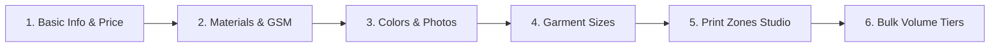
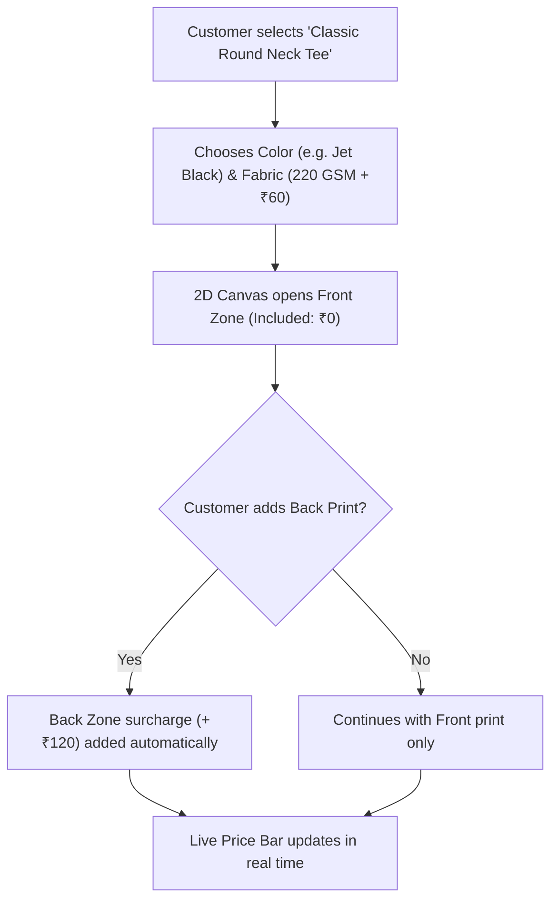
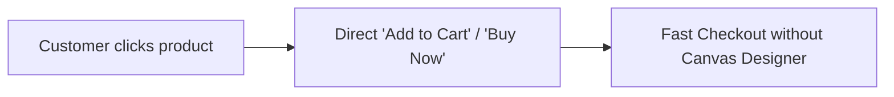

# 📖 Mana Vibe Prints (MVP) — Shop Owner Master Guide
### *Complete Product Catalog, Selling Strategies & Customizer Configuration Manual*

---

## 📌 Introduction & Overview

As the store owner of **Mana Vibe Prints**, you have **100% full dynamic control** over your product catalog, pricing, printable regions, and selling models without writing a single line of code.

Whether you are offering **interactive 2D customizer apparel**, **sublimation mugs**, **ready-made graphic merchandise**, or **custom DTF film transfers**, this manual walks through every feature step-by-step.

---

## 🧭 The 6-Step Product Creation Workflow

| Step | Tab Name | What You Configure |
| :---: | :--- | :--- |
| **1** | **Basic Info** | Product Name, SKU, Category, Base Single-Piece Price, Customizer Toggle. |
| **2** | **Materials & GSM** | Fabric weight variations (e.g., 180 GSM vs 240 GSM Terry) with price add-ons. |
| **3** | **Colors & Mockups** | Color picker (Hex code) and blank photo uploads for each placement angle. |
| **4** | **Garment Sizes** | Size labels (S, M, L, XL, 2XL) and plus-size surcharges (e.g., +₹50 for 2XL). |
| **5** | **Print Zones Studio** | Interactive Bounding Box drag & resize tool, physical print inches, extra side fees. |
| **6** | **Bulk Volume Tiers** | Quantity discount matrix for corporate / college bulk buyers (10+ pcs, 50+ pcs). |

---

## 🎯 5 Core Selling Strategies & Setup Scenarios

---

### 🏷️ Scenario 1: Standard Customizable Apparel (T-Shirts, Hoodies, Polo Shirts)
> **Goal**: Let customers upload their design on the front and optionally add a back print for an extra fee.

#### Step-by-Step Setup:
1. **Basic Info**:
   - **Product Name**: `Classic Round Neck T-Shirt`
   - **Category**: `T-Shirts`
   - **Base Retail Price**: `499`
   - ✅ **Check** `Customizable in 2D Designer`
   - ✅ **Check** `Published / Active`
2. **Materials & GSM**:
   - Row 1: `180 GSM Combed Bio-Washed Cotton` | GSM: `180` | Extra: `0` | **Default**
   - Row 2: `240 GSM Heavyweight French Terry` | GSM: `240` | Extra: `+100`
3. **Colors & Mockups**:
   - Add Color: `Jet Black` (`#111111`) &rarr; Upload Front photo & Back photo.
   - Add Color: `Classic White` (`#FFFFFF`) &rarr; Upload Front photo & Back photo.
4. **Garment Sizes**:
   - `S` (+₹0), `M` (+₹0), `L` (+₹0), `XL` (+₹0), `2XL` (+₹50), `3XL` (+₹80).
5. **Print Zones Studio**:
   - **Zone 1 (`Front`)**: Physical Size: `10.0" × 12.0"` | Extra Surcharge: `0` (Included) | Methods: `DTF, Screen Printing`.
   - **Zone 2 (`Back`)**: Physical Size: `12.0" × 14.0"` | Extra Surcharge: `120` | Methods: `DTF, Screen Printing`.
6. **Bulk Volume Tiers**:
   - `1 – 5 pcs`: `₹499` (0% off)
   - `6 – 20 pcs`: `₹399` (20% off)
   - `21 – 50 pcs`: `₹329` (34% off)
   - `51+ pcs`: `₹249` (50% off)

---

### ☕ Scenario 2: Sublimation Drinkware (Coffee Mugs, Sipper Bottles)
> **Goal**: 360° wrap sublimation printing on glossy ceramic mugs with single fixed sizing.

#### Step-by-Step Setup:
1. **Basic Info**:
   - **Product Name**: `Custom Ceramic Glossy Coffee Mug (11oz)`
   - **Category**: `Ceramic Mugs`
   - **Base Retail Price**: `299`
   - ✅ **Check** `Customizable in 2D Designer`
2. **Materials & GSM**:
   - *(Leave empty — drinkware does not require fabric weights)*.
3. **Colors & Mockups**:
   - Add Color: `Glossy White` (`#FFFFFF`) &rarr; Upload clean blank mug photo.
4. **Garment Sizes**:
   - Label: `11 oz (325 ml)` | Extra: `0`.
5. **Print Zones Studio**:
   - **Zone 1 (`Mug Wrap`)**: Physical Size: `8.5" × 3.5"` | Extra Surcharge: `0` | Method: `Sublimation`.
   - *Drag the bounding box horizontally across the mug belly*.
6. **Bulk Volume Tiers**:
   - `1 – 5 pcs`: `₹299`
   - `6 – 24 pcs`: `₹219` (Corporate gift discount)
   - `25+ pcs`: `₹149` (Bulk event pricing)

---

### 🛍️ Scenario 3: Non-Customizable Ready-to-Ship Retail Merch
> **Goal**: Sell pre-designed brand merchandise, plain blanks, or graphic hoodies **directly** without opening the 2D canvas designer.

#### Step-by-Step Setup:
1. **Basic Info**:
   - **Product Name**: `Mana Vibe Signature Anime Graphic Hoodie`
   - **Category**: `Hoodies & Sweatshirts`
   - **Base Retail Price**: `899`
   - ❌ **UNCHECK** `Customizable in 2D Designer` *(Crucial step!)*
   - ✅ **Check** `Published / Active`
2. **Colors & Mockups**:
   - Upload full photos of the finished printed hoodie.
3. **Garment Sizes**:
   - Add standard sizes `S, M, L, XL, 2XL`.
4. **Print Zones Studio & Volume Tiers**:
   - *(No print zones needed since customer is buying the pre-printed design directly!)*

---

### 🖨️ Scenario 4: Custom DTF Transfers & Film Printing
> **Goal**: Commercial printing service where corporate clients or reseller print shops order custom DTF film transfers.

#### Step-by-Step Setup:
1. **Basic Info**:
   - **Product Name**: `Custom DTF Film Transfer (22" Width)`
   - **Category**: `DTF Printing`
   - **Base Retail Price**: `450` *(per meter)*
   - ✅ **Check** `Customizable in 2D Designer`
2. **Print Zones Studio**:
   - Position: `DTF Transfer` | Physical Size: `22.0" × 39.3" (1 Meter)` | Method: `DTF`.
3. **Bulk Volume Tiers**:
   - `1 – 2 meters`: `₹450/m`
   - `3 – 10 meters`: `₹380/m`
   - `11 – 50 meters`: `₹320/m`
   - `51+ meters`: `₹260/m`

---

### 🚀 Scenario 5: Seasonal Launches & Priority Placement (Display Order)
> **Goal**: Make festival collections (Diwali, IPL, New Year) appear first on the storefront.

1. **Go to `Product Categories`**:
   - Edit your seasonal category (e.g. `IPL Fan Gear`) &rarr; Set **`Display Order: 1`**.
   - Set standard categories to `2`, `3`, `4`.
2. **Result**: The seasonal category immediately jumps to the **first position on the customer homepage and top navigation bar**!

---

## 🛠️ Print Operator Order Pipeline Checklist

When an order arrives in the **Order Pipeline**:
1. Open the order drawer by clicking on the row.
2. Review the customer's composite proof preview.
3. Check the **DPI Quality Badge**:
   - 🟢 `300+ DPI (Crisp)` &rarr; Ready for high-definition print.
   - 🟡 `150-299 DPI` &rarr; Acceptable for medium graphics.
   - 🔴 `<150 DPI` &rarr; Contact customer via 1-Click WhatsApp before printing.
4. Click **`Download 300 DPI Artwork`** to get the uncompressed production PNG/SVG file for your RIP software (e.g. CADlink / AcroRIP / Heat-Press).
5. Click **`Print / Press`** to update the customer that their item is in production.

---

> **🎉 Pro-Tip for Shop Owners**: Always use clean, plain background photos for your blank garments to give customers the most realistic preview in the 2D customizer!
